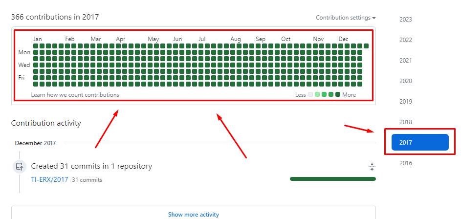
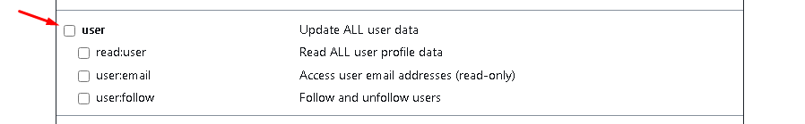

# GitHub History Back

Make your GitHub history go back as far as you want.

#### Attention!

#### This script will perform commits on all dates of the year, leaving the green card complete. If you only want to commit on specific dates, you will find links to other versions of the script at the bottom of the page



# First step

[Create a new repository](https://github.com/new) with the date you wish to travel back in time. Example `2017`


# Second step

[Generate a personal access token](https://github.com/settings/tokens/new) GitHub and copy it. Example below.





# Third step

If you want to generate commits for the entire year, run the script below

```bash
sh -c "$(curl -fsSL https://raw.github.com/TI-ERX/script-yearly-commit/master/index.sh)"
```

Enter your GitHub username and access token and you're ready :)

<br>

### [Script V.1](https://github.com/TI-ERX/script-only-commit) Script to generate just one commit

### [Script V.2](https://github.com/TI-ERX/script-history-back/tree/main) Script to generate several commits at once
